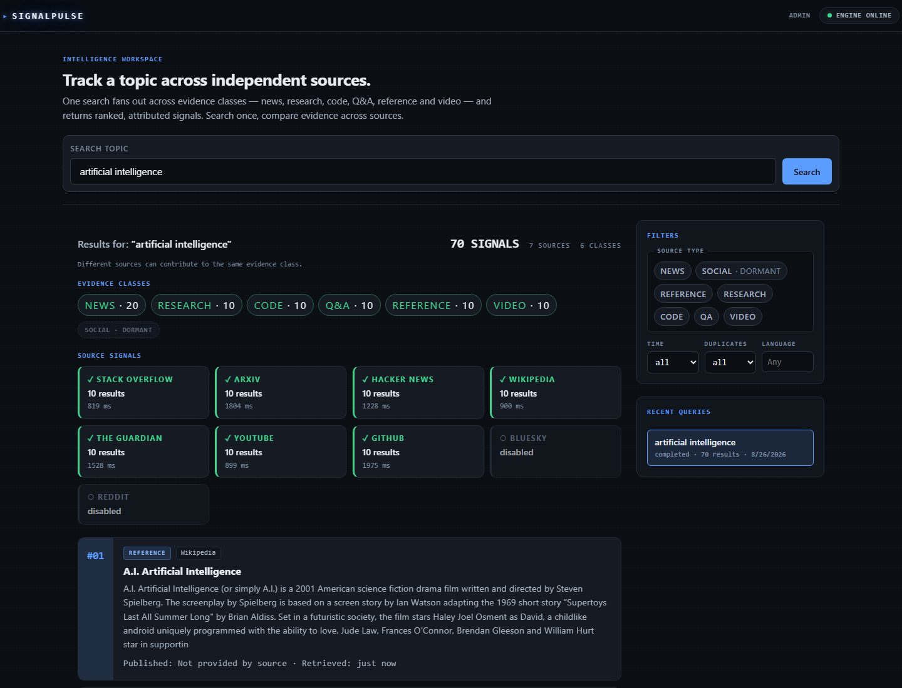
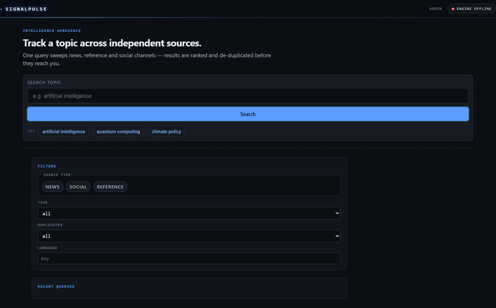
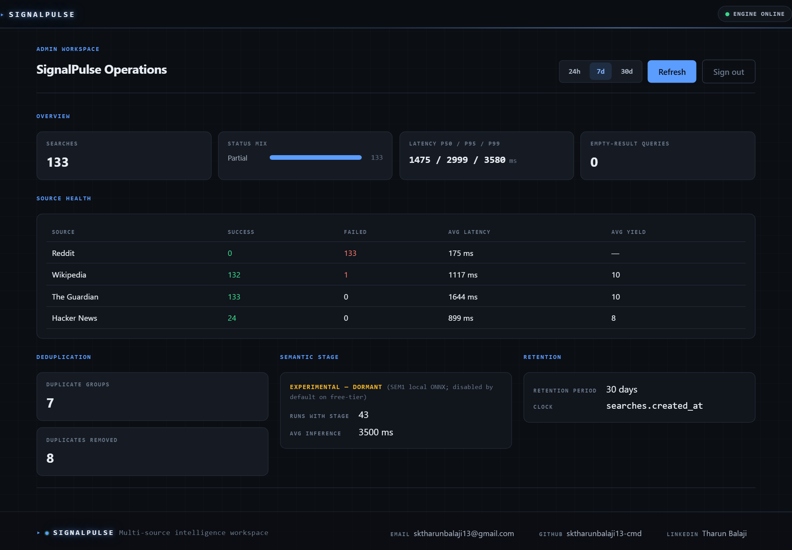
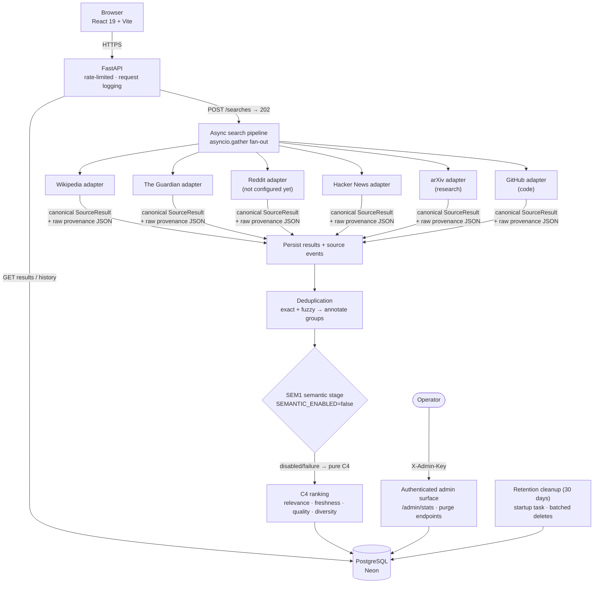

# SignalPulse

**Real-time multi-source information intelligence — news, reference and social results, ranked and de-duplicated in one place.**

**🟢 [Try the live demo](https://signalpulse-frontend.onrender.com)** — one query fans out to Wikipedia, The Guardian, Hacker News, arXiv and GitHub in parallel; results are deduplicated, ranked, and attributed per source.

SignalPulse runs one query across independent sources at the same time, removes duplicates, ranks the surviving signals, and serves them through a small API and workspace UI. It is a working production system: deployed, monitored, authenticated, rate-limited, and governed by an explicit data-retention policy.

## Screenshots

| Landing workspace | Authenticated operations dashboard |
|---|---|
|  |  |

The dashboard renders live production telemetry (search volume, latency percentiles, per-source health, dedup, retention) behind a short-lived HttpOnly session — the admin key never enters the browser.

## Why SignalPulse?

Answering a question well usually means looking in more than one place. News coverage gives recency, encyclopedic sources give stable background, and social discussion gives raw public reaction — but each lives behind its own API with its own result shape, quality quirks, and duplicates. SignalPulse treats that aggregation problem as an engineering problem: canonicalize every source into one contract, merge honestly, rank deliberately, and prove every decision with measurements.

## Status at a glance

| Capability | State |
|---|---|
| Multi-source search (Wikipedia, The Guardian, Hacker News, arXiv, GitHub) | **PRODUCTION** |
| Reddit source adapter | Implemented, credentials not configured in production |
| C4 ranking model | **PRODUCTION** (nDCG@10 = 0.7850 on frozen corpus) |
| Semantic relevance stage (SEM1) | **EXPERIMENTAL — disabled** (see below) |
| Deduplication (annotate, never delete) | **PRODUCTION** |
| Result filtering & pagination | **PRODUCTION** |
| Admin observability (`/admin/stats`) | **PRODUCTION**, authenticated |
| Admin purge (single search / expired) | **PRODUCTION**, authenticated |
| 30-day data retention | **PRODUCTION** |
| GDELT adapter | Evaluated, NO-GO ([ADR 0005](docs/ADR/0005-gdelt-gate.md)) |

## Architecture

Detailed component documentation: [docs/ARCHITECTURE.md](docs/ARCHITECTURE.md).

## Key capabilities

- **Measured in production** — p95 search latency **1.59 s** (24 h window, multi-source fan-out); zero empty-result searches across all traffic; ~0.3 % duplicate rate over ~2,500 ranked results.
- **One query, five source types** — news, reference, social discussion, research literature, and code repositories normalized into a single `SourceResult` contract with full raw-payload provenance.
- **Honest failure handling** — each source is isolated with its own timeout (4.5 s) and database session; one failing source degrades the search to `partial` instead of failing everything.
- **Annotate-don't-delete deduplication** — duplicate clusters are detected (canonical URL, normalized title, fuzzy match), grouped with evidence, and marked; no result row is ever destroyed ([ADR 0006](docs/ADR/0006-dedupe-key-non-unique.md)).
- **C4 ranking** — relevance, freshness, quality, and diversity signals composed into a deterministic total order, persisted per result.
- **Query-time filters** — source type, time window, canonical-only, and language views over persisted rankings without re-ranking.
- **Operational observability** — authenticated aggregate statistics: search volume, latency percentiles, per-source outcomes, dedup metrics, top normalized queries. A protected admin dashboard (`#/admin`) renders this telemetry via a short-lived HttpOnly session cookie — the admin key never enters the browser ([ADR 0016](docs/ADR/0016-admin-observability-dashboard.md)).
- **Data lifecycle** — searches older than 30 days are deleted automatically (batched, transactional, dependency-safe); operators can purge a specific search or all expired records via authenticated endpoints.

## Research & evaluation

Ranking decisions are made against a frozen evaluation corpus (16 queries, 365 judged items) with pre-registered candidates and multi-metric gates. The ledger is intentionally full of NO-GOs:

| Experiment | Result |
|---|---|
| BM25 relevance baseline | Evaluated ([ADR 0007](docs/ADR/0007-bm25-relevance-evaluation.md)) |
| Phrase bonus | NO-GO ([ADR 0008](docs/ADR/0008-phrase-bonus-no-go.md)) |
| Score normalization variants | NO-GO ([ADR 0009](docs/ADR/0009-c4-normalization-no-go.md)) |
| Alternative relevance signal | NO-GO ([ADR 0010](docs/ADR/0010-c4-relevance-signal-no-go.md)) |
| Semantic relevance (SEM1) | Experimental GO ([ADR 0011](docs/ADR/0011-semantic-relevance-decision.md)) |

SEM1 (ONNX-int8 MiniLM, local inference) measured **nDCG@10 = 0.8084 vs C4's 0.7850** on the frozen corpus. It remains **disabled in production** because inference on the Render free tier measured ~3.5 s per search — a latency the product should not pay ([ADR 0012](docs/ADR/0012-semantic-production-architecture.md)). The code ships dormant (`SEMANTIC_ENABLED=false`), fails safe to pure C4, and can be activated by configuration alone.

The NO-GOs are deliberate outcomes of the evidence process, not unfinished work.

## Security & privacy

- No user accounts; the service is anonymous by design. No IPs, sessions, or identifiers are stored.
- **Admin surface** (`/api/v1/admin/stats`, purge endpoints) requires an `X-Admin-Key` header checked with a constant-time comparison; it fails closed when unconfigured. The admin dashboard authenticates by exchanging the key once for a short-lived HttpOnly cookie — the key never reaches browser code or storage.
- **Retention:** searches and their dependent rows persist for 30 days (`searches.created_at` clock), then are deleted automatically in FK-safe, transactional batches. Operators can purge immediately ([ADR 0013](docs/ADR/0013-data-retention-policy.md)).
- Request logging records method, path, status, and latency only — never query text, headers, or secrets.
- See [docs/PRIVACY.md](docs/PRIVACY.md) for what is stored and why.

## Testing

| Suite | Count |
|---|---|
| Backend (pytest): pipeline, ranking, dedup, adapters, auth, retention, source availability, Postgres compatibility | 418 passed, 5 skipped |
| Frontend (Vitest + Testing Library) | 64 passed |
| Evaluation harness (corpus determinism, metric math, candidate gates) | 98 passed |

Linting: `ruff` across backend and eval. CI runs all suites plus the frontend TypeScript build on every push ([.github/workflows/ci.yml](.github/workflows/ci.yml)).

## Technology stack

- **Backend:** Python 3.11, FastAPI, SQLAlchemy 2, Alembic, httpx, ONNX Runtime + 🤗 tokenizers
- **Database:** PostgreSQL (Neon serverless)
- **Frontend:** React 19, Vite 6, TypeScript 5.7, Vitest + Testing Library
- **Ops:** GitHub Actions CI, Render (free tier)

## Deployment

- Backend: Render web service, auto-deploys from `main`. Schema managed by Alembic; runtime uses `create_all` for idempotent bootstrapping.
- Frontend: Render static site from `frontend/dist`.
- Database: Neon free-tier PostgreSQL. Migrations applied with `alembic upgrade head` from `backend/`.
- Operational procedures: [docs/RUNBOOK.md](docs/RUNBOOK.md).

## Current limitations

- Reddit is implemented but disabled until credentials are configured; it renders as a neutral "disabled" source and does not affect search status — searches over the enabled sources report `completed` ([ADR 0017](docs/ADR/0017-source-availability-semantics.md)).
- Semantic ranking is implemented and measurably better offline, but disabled in production pending infrastructure with acceptable inference latency.
- Recent-searches history is stored locally in your browser only (query labels never leave your device); there are no user accounts.
- Single-process assumptions (in-memory rate limiting and caches) hold on the current single-worker deployment.

## Roadmap

Completed milestone history and next steps live in [docs/ROADMAP.md](docs/ROADMAP.md). Planned next (M22 multi-source expansion program, one gated source at a time):

1. **M22.2 — GitHub** ✅ shipped ([ADR 0019](docs/ADR/0019-github-code-source.md))
2. **M22.3 — Stack Overflow** (developer Q&A; free API key)
3. **M22.4 — Bluesky** (public social discussion) · **M22.5 — Semantic Scholar** (academic depth, after dedup-overlap measurement)
4. Blocked externally: Reddit approval, X (no viable free tier). NO-GO on record: GDELT ([ADR 0005](docs/ADR/0005-gdelt-gate.md)), Crossref, Mastodon.
5. Deferred: SEM1 activation (infrastructure-gated), accounts, alerting.

## Documentation

| Document | Purpose |
|---|---|
| [PROJECT_SPEC.md](PROJECT_SPEC.md) | Original architectural contract and source validation |
| [docs/ARCHITECTURE.md](docs/ARCHITECTURE.md) | Current system overview |
| [docs/ROADMAP.md](docs/ROADMAP.md) | Milestone history and plan |
| [docs/RUNBOOK.md](docs/RUNBOOK.md) | Operational procedures |
| [docs/PRIVACY.md](docs/PRIVACY.md) | Data storage, retention, and logging boundaries |
| [docs/ADR/](docs/ADR) | Decision records 0001–0018 |

## License

See [LICENSE](LICENSE).
