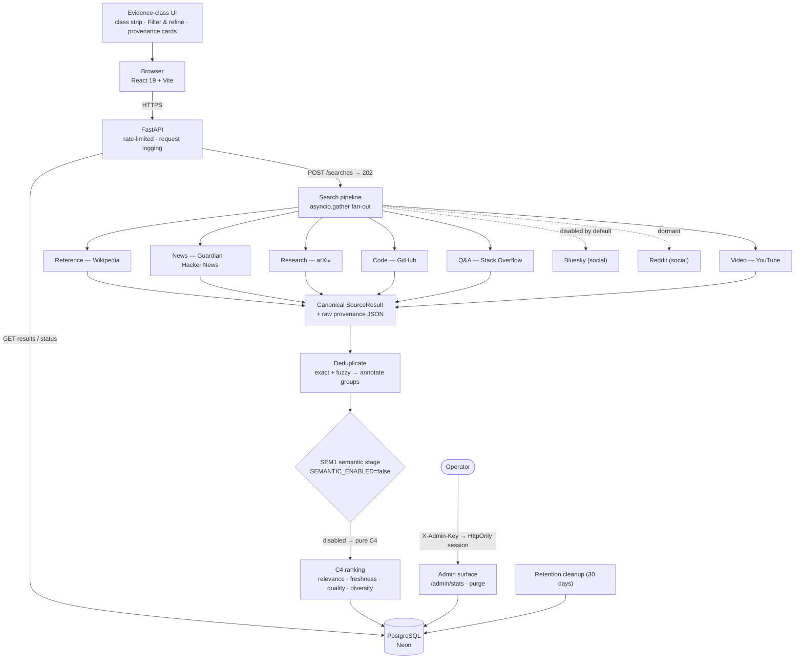

# SignalPulse

**Search once. Compare evidence across sources.**

SignalPulse is a multi-source intelligence workspace that fans a query across independent evidence sources, normalizes and deduplicates the results, ranks them using explainable signals, and presents their provenance and freshness in a focused research interface.

🟢 **[Try the live demo](https://signalpulse-frontend.onrender.com)** — deployed, running against real production APIs.


## What it does

SignalPulse treats the "look in many places" problem as an engineering problem. One query fans out in parallel to a set of independent public APIs, each with its own result shape, quality quirks, and duplicates. The pipeline canonicalizes every source into one contract, merges duplicates honestly, ranks deliberately, and returns a provenance-first results view — you always see *where* each signal came from and *how fresh* it is.

It is a **working production system**: deployed on Render + Neon, monitored through an authenticated admin surface, rate-limited, and governed by an explicit 30-day data-retention policy.

## Why it exists

A good answer usually means consulting more than one kind of evidence: news for recency, encyclopedic sources for stable background, literature for depth, code and Q&A for the practical layer. Each lives behind its own API with its own quality quirks. SignalPulse exists to make that aggregation honest — and to make every decision behind it *measurable* rather than asserted.

## Evidence classes & sources

SignalPulse does not treat every source as an undifferentiated search result. Sources are grouped into an **evidence-class taxonomy**, and multiple sources can contribute to the same class:

| Evidence class | Active production sources | Role |
|---|---|---|
| **Reference** | Wikipedia | Stable background |
| **News** | The Guardian · Hacker News | Recency and discussion |
| **Research** | arXiv | Literature |
| **Code** | GitHub | Repositories |
| **Q&A** | Stack Overflow | Developer answers |
| **Video** | YouTube | Explainers and course content |
| **Social** | — *(Bluesky disabled by default; Reddit dormant)* | Community reaction |

**7 active production sources** contribute across the implemented evidence-class taxonomy. **Bluesky is disabled by default** and **Reddit remains dormant** — both are represented honestly, never silently failing (see [Source status semantics](#evidence-gated-engineering)).

- **Evidence class ≠ source.** Two news outlets both belong to the `news` class; each result still retains its exact source provenance.
- Results retain **source, author, published time, retrieved time, and raw payload** end-to-end.
- **Freshness and source quality influence ranking**; **deduplication** prevents repeated evidence (the same wire story from many outlets) from overwhelming the workspace.

## Architecture



Detailed component documentation: [docs/ARCHITECTURE.md](docs/ARCHITECTURE.md).

## Ranking & deduplication

- **C4 ranking** — a deterministic, explainable score: relevance, freshness (exponential decay), source quality, and diversity. Every component is stored per result so "why is this #1?" is answerable. Baseline nDCG@10 **0.7850** on a frozen evaluation corpus.
- **Annotate-don't-delete deduplication** — exact URL/title matches plus fuzzy title clustering mark duplicates into groups with evidence; no result row is ever destroyed ([ADR 0006](docs/ADR/0006-dedupe-key-non-unique.md)). The UI shows the canonical pick and its duplicate context.
- **Query-time filters** — evidence class, time window, canonical-only, and language views over persisted rankings without re-ranking.

## Provenance & explainability

- Every result carries **source, author, published time, retrieved time, and the original raw API payload** (stored for audit).
- The workspace surfaces **which evidence classes contributed to a search** (an evidence-class strip), **relative freshness with exact timestamps on hover**, and a clear **class-vs-source** separation.
- Source **status is honest**: active sources report results; disabled/dormant sources render neutrally and never masquerade as failures ([ADR 0017](docs/ADR/0017-source-availability-semantics.md)).

## Evidence-gated engineering

The most important thing about SignalPulse is *how* it was built. Every source and ranking decision followed the same loop:

```
Hypothesis → feasibility audit → pre-registered gate → live measurement
→ decision → minimal implementation → regression proof → production verification
```

Concrete examples from the M22.x expansion program:

- **YouTube** — live API feasibility audit → keyed probe → relevance/latency/quota measurement → conditional GO → implementation → corpus regression → production verification. Quota exhaustion (403 `quotaExceeded`) maps to `rate_limited`, not failure ([ADR 0023](docs/ADR/0023-youtube-video-source.md)).
- **Reddit** — third-party provider provenance audit identified authorization uncertainty; unofficial intermediaries were **rejected**, preserving the official API as the only acceptable path. Reddit is **dormant** pending an appropriate authorized integration ([ADR 0022](docs/ADR/0022-third-party-reddit-providers-no-go.md)).
- **Bluesky** — a production reliability anomaly (persistent anonymous HTTP 403) was pursued with telemetry accumulation, then a **controlled one-shot diagnostic** that classified the response as an `EDGE_RULE_HTML` edge administrative block. The anonymous path was **disabled by default** via the M22.13 hybrid decision; authenticated feasibility was deliberately left as a separate, future-gated investigation rather than an implemented capability ([ADR 0024](docs/ADR/0024-bluesky-disable-hybrid.md)).
- **arXiv** — production observability surfaced an unexpected failure; root cause was traced to an author-string truncation; a minimal fix plus regression test restored reliability.

The research ledger is intentionally full of **NO-GOs** — each one a measured decision that protected the production ranker from unproven complexity, not abandoned work:

| Experiment | Result |
|---|---|
| BM25 relevance baseline | Evaluated ([ADR 0007](docs/ADR/0007-bm25-relevance-evaluation.md)) |
| Phrase bonus | NO-GO ([ADR 0008](docs/ADR/0008-phrase-bonus-no-go.md)) |
| Score-normalization variants | NO-GO ([ADR 0009](docs/ADR/0009-c4-normalization-no-go.md)) |
| Alternative relevance signal | NO-GO ([ADR 0010](docs/ADR/0010-c4-relevance-signal-no-go.md)) |
| Semantic relevance (SEM1) | Experimental GO ([ADR 0011](docs/ADR/0011-semantic-relevance-decision.md)) |
| GDELT | NO-GO — reliability/latency disqualifier ([ADR 0005](docs/ADR/0005-gdelt-gate.md)) |

SEM1 (ONNX-int8 MiniLM, local inference) measured **nDCG@10 = 0.8084 vs C4's 0.7850** on the frozen corpus, but remains **disabled in production**: free-tier inference measured ~3.5 s per search — latency the product should not pay ([ADR 0012](docs/ADR/0012-semantic-production-architecture.md)). It ships dormant, fails safe to pure C4, and can be activated by configuration alone.

### Source status semantics

| Source | Status |
|---|---|
| Wikipedia · The Guardian · Hacker News · arXiv · GitHub · Stack Overflow · YouTube | **Active** (production) |
| Bluesky | **Implemented, disabled by default** — anonymous production search returned a persistent 403 edge-administrative block; the anonymous path was disabled through the M22.13 hybrid decision. Authenticated feasibility remains a separate future gate, not an implemented capability ([ADR 0024](docs/ADR/0024-bluesky-disable-hybrid.md)) |
| Reddit | **Dormant** — official API is the preferred future path; third-party acquisition paths were rejected on provenance/authorization grounds ([ADR 0022](docs/ADR/0022-third-party-reddit-providers-no-go.md)) |

## Production status

- Live at [https://signalpulse-frontend.onrender.com](https://signalpulse-frontend.onrender.com), auto-deployed from `main`.
- **Measured in production** — p95 search latency **1.59 s** (24 h window, multi-source fan-out); zero empty-result searches; ~0.3 % duplicate rate (M18 production audit). Per-source live gates measured p50 0.40 s (YouTube), 0.58 s (GitHub), 0.95 s (arXiv), 0.98 s (Stack Overflow).
- **Observability** — authenticated `/admin/stats` (search volume, latency percentiles, per-source outcomes, dedup, retention) behind a short-lived HttpOnly session; the admin key never enters the browser ([ADR 0016](docs/ADR/0016-admin-observability-dashboard.md)).
- **Data lifecycle** — 30-day retention with batched, FK-safe cleanup; operators can purge immediately ([ADR 0013](docs/ADR/0013-data-retention-policy.md)).
- **Failure isolation** — each source has its own timeout and database session; one failing source degrades to `partial`, never a global failure.

## Validation & tests

| Suite | Result |
|---|---|
| Backend (pytest): pipeline, ranking, dedup, adapters, auth, retention, source availability, Postgres compatibility | **472 passed, 5 skipped** (477 collected) |
| Frontend (Vitest + Testing Library) | **106 passed** |
| Evaluation harness (corpus determinism, metric math, candidate gates) | **98 passed** |

Linting: `ruff` across backend and eval. CI runs all suites plus the frontend TypeScript build and production build on every push ([.github/workflows/ci.yml](.github/workflows/ci.yml)).

The final **production UX validation** ran 22 automated checks against the deployed application across **1440px desktop, 1024px tablet, 640px and 360px mobile** — covering responsive layout, evidence-class interaction, filtering/refinement, provenance and freshness presentation, disabled-source semantics, accessibility behavior, and API-contract preservation.

## Security & privacy

- **Secrets stay server-side.** API keys are environment variables only, never committed; `.env.example` contains names, not values.
- **No user accounts** — the service is anonymous by design; no IPs, sessions, or identifiers are stored.
- **Admin surface** requires an `X-Admin-Key` checked in constant time and fails closed when unconfigured; the dashboard exchanges the key once for a short-lived HttpOnly cookie.
- **Provenance is retained** — raw API payloads are stored for audit; credential-shaped keys are stripped at the adapter boundary.
- **Unofficial data providers were rejected** when authorization was unclear (Reddit third-party audit).
- **Disabled sources are represented honestly** rather than silently failing or faking availability.
- Request logging records method, path, status, and latency only — never query text, headers, or secrets.
- See [docs/PRIVACY.md](docs/PRIVACY.md) for what is stored and why.

## Decisions (ADRs)

24 architecture decision records cover the project's history — including the NO-GOs, the M21.3 source-availability semantics, every M22.x source gate, and the M22.13 Bluesky disposition:

[docs/ADR/](docs/ADR) — records **0001–0024**

Deferred decisions are distinguished from rejected ones: NO-GOs (GDELT, phrase bonus, normalization variants, relevance signal, third-party Reddit) are closed decisions; deferred items are listed under [Project status](#project-status).

## Local development

Prerequisites: Python 3.11, Node 20+, PostgreSQL (optional — SQLite for local dev).

```bash
# Backend
cd backend
python -m venv .venv && .venv/Scripts/activate      # Windows; use source .venv/bin/activate on macOS/Linux
pip install -e .[dev]
cp .env.example .env                                # edit DATABASE_URL for Postgres if desired
uvicorn app.main:app --reload                       # http://127.0.0.1:8000
```

```bash
# Frontend (separate terminal)
cd frontend
npm install
VITE_API_BASE=http://127.0.0.1:8000 npm run dev     # http://localhost:5173
```

Environment variables are documented in [.env.example](.env.example) (root) and [backend/.env.example](backend/.env.example). Set a Guardian key and the other optional keys to enable those sources; leaving them empty disables the source cleanly.

Run tests:

```bash
cd backend && pytest                              # backend suite
cd frontend && npm test && npm run build          # frontend tests + typecheck + production build
```

Deployment and operational procedures: [docs/RUNBOOK.md](docs/RUNBOOK.md).

## Project status

**Complete.** The engineering, production deployment, and UX work are finished and live.

Deferred opportunities (not missing requirements):

- **M22.5 — Semantic Scholar (deferred).** The decisive **keyed** arXiv↔Semantic Scholar duplicate-overlap measurement remains incomplete; Semantic Scholar was *not* rejected. It stays deferred pending that measurement.
- **Authenticated Bluesky feasibility** — a future, separately-gated investigation; not an implemented capability.
- **SEM1 activation** — measured quality gain does not justify free-tier inference latency; revisit after an infrastructure upgrade (config-only to enable).
- **FE-G / FE-I / FE-K / FE-J (frontend backlog)** — empty-state recovery suggestions, a deeper evidence-class lens, keyboard result navigation, and "also reported by N sources" (requires backend data).

## Documentation

| Document | Purpose |
|---|---|
| [docs/ARCHITECTURE.md](docs/ARCHITECTURE.md) | System overview |
| [docs/ROADMAP.md](docs/ROADMAP.md) | Milestone history and status |
| [docs/RUNBOOK.md](docs/RUNBOOK.md) | Operational procedures |
| [docs/PRIVACY.md](docs/PRIVACY.md) | Data storage, retention, and logging boundaries |
| [docs/ADR/](docs/ADR) | Decision records 0001–0024 |
| [PROJECT_SPEC.md](PROJECT_SPEC.md) | Original architectural contract and source validation |

## License

[MIT](LICENSE)